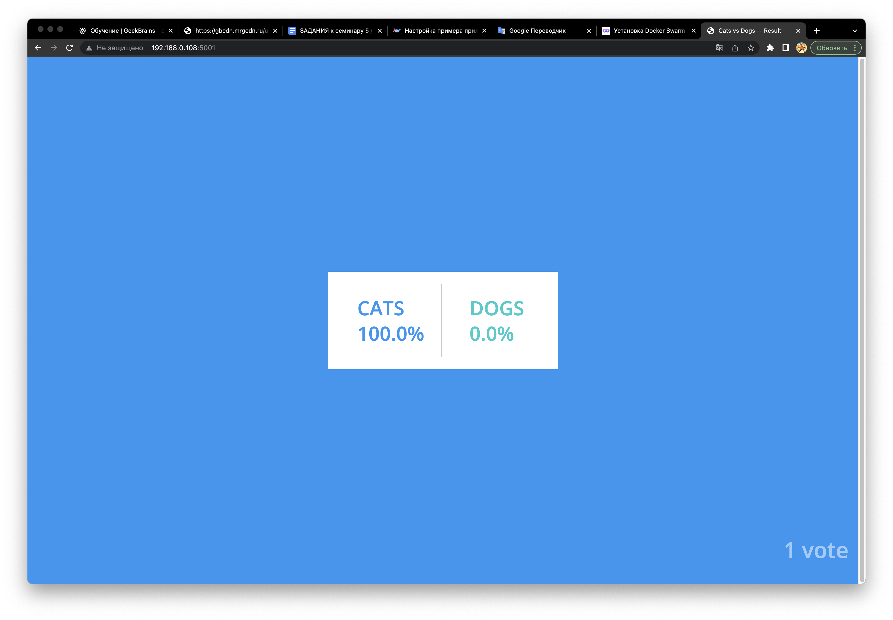

**Задание:**Проделать лабараторную ( https://bday2021.play-with-docker.com/voting-app/ ) с четырьмя нодами.

```
root@docker-server1:~/example-voting-app# docker service ls
ID             NAME          MODE         REPLICAS   IMAGE                                          PORTS
u97lbo06w65c   vote_db       replicated   1/1        postgres:15-alpine                             
hy485jxoq8y5   vote_redis    replicated   1/1        redis:alpine                                   
540itggharsy   vote_result   replicated   1/1        dockersamples/examplevotingapp_result:latest   *:5001->80/tcp
vqhg02ab5wfo   vote_vote     replicated   2/2        dockersamples/examplevotingapp_vote:latest     *:5000->80/tcp
mj0dtw4cm6xj   vote_worker   replicated   2/2        dockersamples/examplevotingapp_worker:latest   

```

Посмотреть docker node ls
```
root@docker-server1:~/example-voting-app# docker node ls
ID                            HOSTNAME         STATUS    AVAILABILITY   MANAGER STATUS   ENGINE VERSION
524w3cmj3z24szk98hch0odxo *   docker-server1   Ready     Active         Leader           23.0.2
uhq531uixaxp9roxh3m8wqub2     docker-server2   Ready     Active                          23.0.2
```

"Уронить" (выключить) одну ноду
```
root@docker-server1:~/example-voting-app# docker node ls
ID                            HOSTNAME         STATUS    AVAILABILITY   MANAGER STATUS   ENGINE VERSION
524w3cmj3z24szk98hch0odxo *   docker-server1   Ready     Active         Leader           23.0.2
uhq531uixaxp9roxh3m8wqub2     docker-server2   Down      Active                          23.0.2
```

